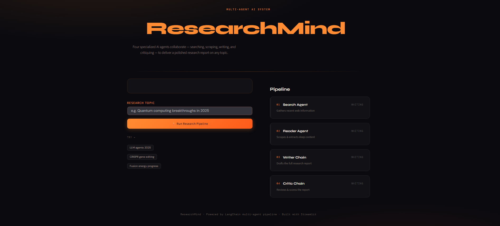
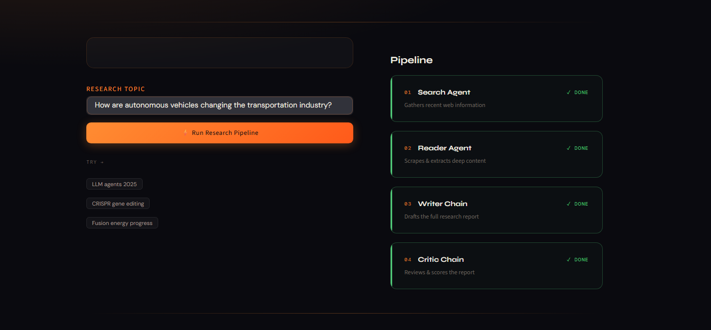
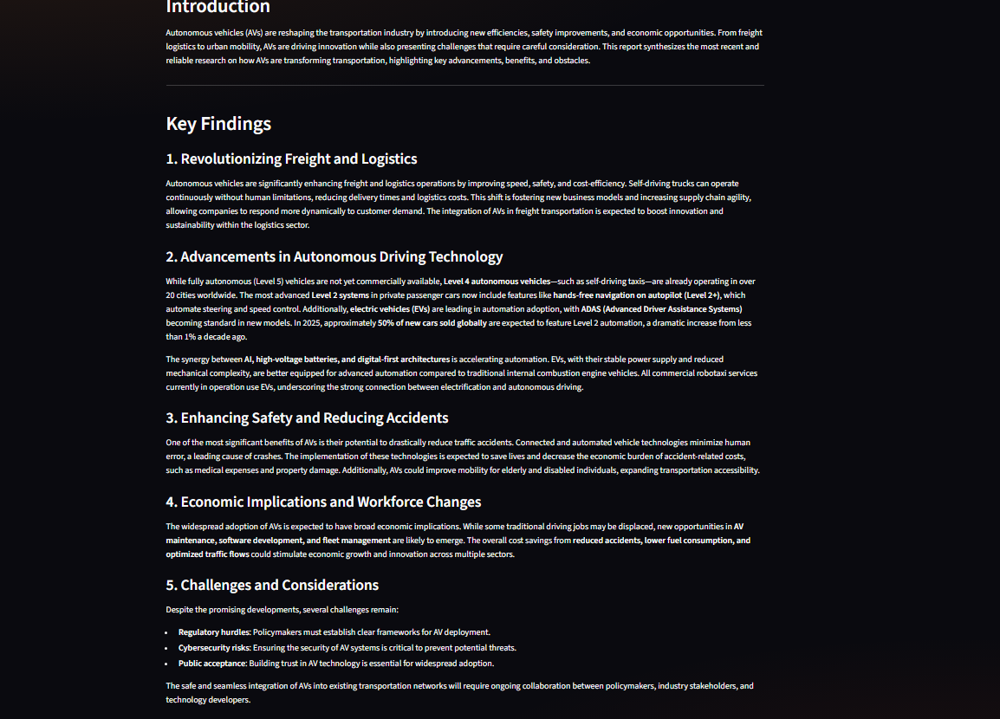
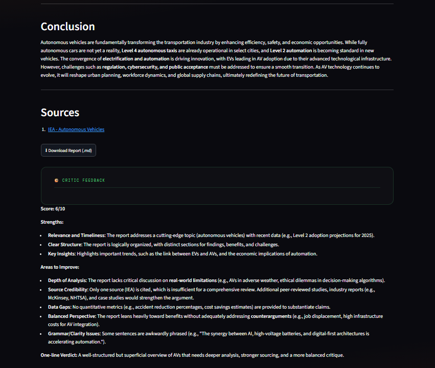

🧠 ResearchMind

Autonomous Multi-Agent AI Research Assistant

--------------------------------------------------

✨ Features

🔍 Search Agent
📄 Reader Agent
✍ Writer Agent
🧐 Critic Agent

--------------------------------------------------

Architecture

             User
               │
               ▼
      ┌────────────────┐
      │ Search Agent   │
      └────────────────┘
               │
               ▼
      ┌────────────────┐
      │ Reader Agent   │
      └────────────────┘
               │
               ▼
      ┌────────────────┐
      │ Writer Agent   │
      └────────────────┘
               │
               ▼
      ┌────────────────┐
      │ Critic Agent   │
      └────────────────┘
               │
               ▼
        Research Report

--------------------------------------------------

Tech Stack

Python
LangChain
LangGraph
Mistral AI
Tavily
BeautifulSoup
Streamlit

--------------------------------------------------

Screenshots
# 🧠 ResearchMind

<<<<<<< HEAD
Autonomous Multi-Agent AI Research Assistant

---

## Homepage
=======
## 📸 Homepage
>>>>>>> 42ba3dc (Updated README with screenshots)

---

<<<<<<< HEAD
## Multi-Agent Pipeline
=======
## ⚙️ Multi-Agent Pipeline
>>>>>>> 42ba3dc (Updated README with screenshots)

---

<<<<<<< HEAD
## Final Research Report
=======
## 📄 Final Research Report
>>>>>>> 42ba3dc (Updated README with screenshots)

---

<<<<<<< HEAD
## AI Critic Feedback
=======
## 🧐 AI Critic Feedback
>>>>>>> 42ba3dc (Updated README with screenshots)

--------------------------------------------------

Installation

git clone ...

pip install -r requirements.txt

streamlit run app.py
